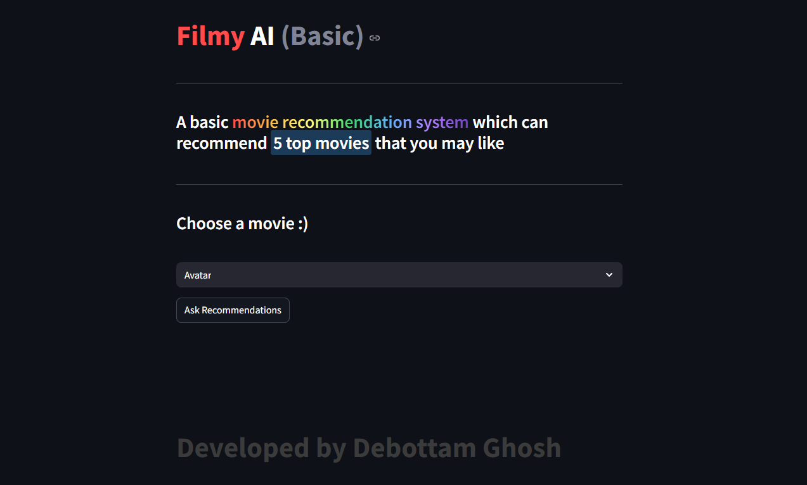

# Filmy AI (Basic) - Movie Recommender System

A content-based movie recommender system built with **Python** and **Streamlit**.  
Get instant movie recommendations based on your favorite film!

🔗 **Live App**: [Try it on Streamlit!](https://filmy-ai-basic.streamlit.app)

---

## Limitations

The data used for this project is of TMDB database. Since TMDB has stopped working in India in recent times, this model cannot fetch the posters of the recommended movies from TMDB API. Instead of this, it only shows the name of the recommend movies. 
That's why I named it Filmy AI Basic. 
I am working on a project to create an advanced recommendation sytem that will not only recommened movies with poster but also it will show top rated movies of that particular genre, most 
popular movies, top movies of the same director or cast. I will name it Filmy AI pro. Whenever the project is completed I will share it here also.

##  Features

- Recommends 5 similar movies based on a selected title
- Clean and interactive UI with Streamlit
- Uses cosine similarity on movie features
- Hosted for free on Streamlit Cloud

---

##  How It Works

1. Loads preprocessed movie features (`movie_dict.pkl`)
2. Downloads a similarity matrix from Google Drive
3. Matches the selected movie using cosine similarity
4. Shows top 5 recommendations

---

## Technologies Used

- Python
- Pandas
- Streamlit
- gdown (for downloading large model files)

---
